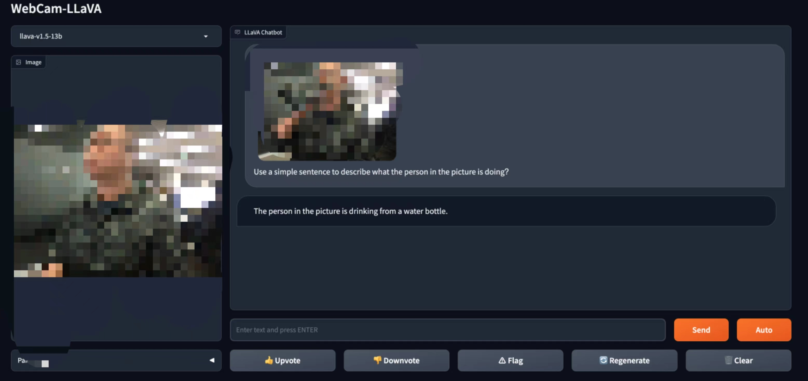
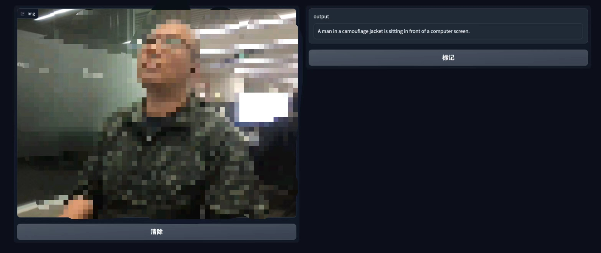

# 💻+🌋 WebCam-LLaVA

This is a very simple implementation of video streaming + multi-modal large language model.
We provide a total of three different combination solutions:

1) Click button to capture image from camera
2) Automatically capture one frame every second and generate corresponding text description
3) Automatically describe video content at regular intervals (settable intervals)

### 1. Click button to capture image from camera
For the method of starting the model, please refer to the llava official documentation. The specific instructions are as follows.
```shell
python -m llava.serve.controller --host 0.0.0.0 --port 10000
python -m webcam_app.manual --controller http://localhost:10000 --model-list-mode reload --port 10001
python -m llava.serve.model_worker --host 0.0.0.0 --controller http://localhost:10000 --port 40000 --worker http://localhost:40000 --model-path /apdcephfs_cq4/share_2942043/data/palchenli/projects/stream/llava-v1.5-13b
```

The log of controller
```shell
2023-11-28 17:15:36 | INFO | controller | args: Namespace(host='0.0.0.0', port=10000, dispatch_method='shortest_queue')
2023-11-28 17:15:36 | INFO | controller | Init controller
2023-11-28 17:15:36 | ERROR | stderr | INFO:     Started server process [86821]
2023-11-28 17:15:36 | ERROR | stderr | INFO:     Waiting for application startup.
2023-11-28 17:15:36 | ERROR | stderr | INFO:     Application startup complete.
2023-11-28 17:15:36 | ERROR | stderr | INFO:     Uvicorn running on http://0.0.0.0:10000 (Press CTRL+C to quit)
2023-11-28 17:17:30 | INFO | controller | Register a new worker: http://localhost:40000
2023-11-28 17:17:30 | INFO | controller | Register done: http://localhost:40000, {'model_names': ['llava-v1.5-13b'], 'speed': 1, 'queue_length': 0}
2023-11-28 17:17:30 | INFO | stdout | INFO:     127.0.0.1:46220 - "POST /register_worker HTTP/1.1" 200 OK
2023-11-28 17:17:45 | INFO | controller | Receive heart beat. http://localhost:40000
2023-11-28 17:17:45 | INFO | stdout | INFO:     127.0.0.1:46594 - "POST /receive_heart_beat HTTP/1.1" 200 OK
2023-11-28 17:18:00 | INFO | controller | Receive heart beat. http://localhost:40000
2023-11-28 17:18:00 | INFO | stdout | INFO:     127.0.0.1:46910 - "POST /receive_heart_beat HTTP/1.1" 200 OK
2023-11-28 17:18:15 | INFO | controller | Receive heart beat. http://localhost:40000
2023-11-28 17:18:15 | INFO | stdout | INFO:     127.0.0.1:47770 - "POST /receive_heart_beat HTTP/1.1" 200 OK
2023-11-28 17:18:24 | INFO | controller | Register a new worker: http://localhost:40000
2023-11-28 17:18:24 | INFO | controller | Register done: http://localhost:40000, {'model_names': ['llava-v1.5-13b'], 'speed': 1, 'queue_length': 0}
2023-11-28 17:18:24 | INFO | stdout | INFO:     127.0.0.1:48552 - "POST /refresh_all_workers HTTP/1.1" 200 OK
2023-11-28 17:18:24 | INFO | stdout | INFO:     127.0.0.1:48556 - "POST /list_models HTTP/1.1" 200 OK
2023-11-28 17:18:30 | INFO | controller | Receive heart beat. http://localhost:40000
2023-11-28 17:18:30 | INFO | stdout | INFO:     127.0.0.1:48764 - "POST /receive_heart_beat HTTP/1.1" 200 OK
```

The log of worker
```shell
2023-11-28 17:16:18 | INFO | model_worker | args: Namespace(host='0.0.0.0', port=40000, worker_address='http://localhost:40000', controller_address='http://localhost:10000', model_path='/apdcephfs_cq4/share_2942043/data/palchenli/projects/stream/llava-v1.5-13b', model_base=None, model_name=None, device='cuda', multi_modal=False, limit_model_concurrency=5, stream_interval=1, no_register=False, load_8bit=False, load_4bit=False)
2023-11-28 17:16:18 | INFO | model_worker | Loading the model llava-v1.5-13b on worker f1bfda ...
config.json:   0%|                                                             | 0.00/4.76k [00:00<?, ?B/s]
config.json: 100%|████████████████████████████████████████████████████| 4.76k/4.76k [00:00<00:00, 36.5MB/s]
2023-11-28 17:16:20 | ERROR | stderr |
Loading checkpoint shards:   0%|                                                     | 0/3 [00:00<?, ?it/s]
Loading checkpoint shards:  33%|███████████████                              | 1/3 [00:06<00:12,  6.15s/it]
Loading checkpoint shards:  67%|██████████████████████████████               | 2/3 [00:12<00:06,  6.07s/it]
Loading checkpoint shards: 100%|█████████████████████████████████████████████| 3/3 [00:15<00:00,  5.04s/it]
Loading checkpoint shards: 100%|█████████████████████████████████████████████| 3/3 [00:15<00:00,  5.32s/it]
2023-11-28 17:16:37 | ERROR | stderr |
preprocessor_config.json:   0%|                                                  | 0.00/316 [00:00<?, ?B/s]
preprocessor_config.json: 100%|███████████████████████████████████████████| 316/316 [00:00<00:00, 2.80MB/s]
2023-11-28 17:16:38 | ERROR | stderr |
pytorch_model.bin: 100%|██████████████████████████████████████████████| 1.71G/1.71G [00:45<00:00, 37.3MB/s]
2023-11-28 17:17:26 | ERROR | stderr |
2023-11-28 17:17:30 | INFO | model_worker | Register to controller
2023-11-28 17:17:30 | ERROR | stderr | INFO:     Started server process [87000]
2023-11-28 17:17:30 | ERROR | stderr | INFO:     Waiting for application startup.
2023-11-28 17:17:30 | ERROR | stderr | INFO:     Application startup complete.
2023-11-28 17:17:30 | ERROR | stderr | INFO:     Uvicorn running on http://0.0.0.0:40000 (Press CTRL+C to quit)
2023-11-28 17:17:45 | INFO | model_worker | Send heart beat. Models: ['llava-v1.5-13b']. Semaphore: None. global_counter: 0
2023-11-28 17:18:00 | INFO | model_worker | Send heart beat. Models: ['llava-v1.5-13b']. Semaphore: None. global_counter: 0
2023-11-28 17:18:15 | INFO | model_worker | Send heart beat. Models: ['llava-v1.5-13b']. Semaphore: None. global_counter: 0
2023-11-28 17:18:24 | INFO | stdout | INFO:     127.0.0.1:52604 - "POST /worker_get_status HTTP/1.1" 200 OK
2023-11-28 17:18:30 | INFO | model_worker | Send heart beat. Models: ['llava-v1.5-13b']. Semaphore: None. global_counter: 0
2023-11-28 17:18:45 | INFO | model_worker | Send heart beat. Models: ['llava-v1.5-13b']. Semaphore: None. global_counter: 0
2023-11-28 17:19:00 | INFO | model_worker | Send heart beat. Models: ['llava-v1.5-13b']. Semaphore: None. global_counter: 0
2023-11-28 17:19:15 | INFO | model_worker | Send heart beat. Models: ['llava-v1.5-13b']. Semaphore: None. global_counter: 0
```

The input is the real-time information of the camera. When you want to describe it, click the send button to get the results.

The gradio page of this application:



### 2. Automatically capture one frame every second and generate corresponding text description

The startup methods of controller and worker are the same as above.

```shell
python -m webcam_app.auto_streaming.py --controller http://localhost:10000 --model-list-mode reload --port 10001
```

Since it is set to take screenshots and describe them every second automatically, you can log in to the Gradio page, as shown below.



The log of gradio as follows:

```shell
2023-11-28 17:27:59 | INFO | sentence_transformers.SentenceTransformer | Load pretrained SentenceTransformer: hfl/chinese-roberta-wwm-ext-large
.gitattributes:   0%|                                                            | 0.00/391 [00:00<?, ?B/s]
.gitattributes: 100%|█████████████████████████████████████████████████████| 391/391 [00:00<00:00, 1.42MB/s]
2023-11-28 17:28:01 | ERROR | stderr |
README.md:   0%|                                                               | 0.00/2.07k [00:00<?, ?B/s]
README.md: 100%|██████████████████████████████████████████████████████| 2.07k/2.07k [00:00<00:00, 9.78MB/s]
2023-11-28 17:28:01 | ERROR | stderr |
added_tokens.json:   0%|                                                        | 0.00/2.00 [00:00<?, ?B/s]
added_tokens.json: 100%|████████████████████████████████████████████████| 2.00/2.00 [00:00<00:00, 15.9kB/s]
2023-11-28 17:28:02 | ERROR | stderr |
config.json:   0%|                                                               | 0.00/690 [00:00<?, ?B/s]
config.json: 100%|████████████████████████████████████████████████████████| 690/690 [00:00<00:00, 8.29MB/s]
2023-11-28 17:28:03 | ERROR | stderr |
pytorch_model.bin: 100%|██████████████████████████████████████████████| 1.31G/1.31G [01:51<00:00, 11.7MB/s]
2023-11-28 17:29:57 | ERROR | stderr |
special_tokens_map.json:   0%|                                                   | 0.00/112 [00:00<?, ?B/s]
special_tokens_map.json: 100%|█████████████████████████████████████████████| 112/112 [00:00<00:00, 626kB/s]
2023-11-28 17:29:57 | ERROR | stderr |
tokenizer.json:   0%|                                                           | 0.00/269k [00:00<?, ?B/s]
tokenizer.json: 100%|███████████████████████████████████████████████████| 269k/269k [00:00<00:00, 1.27MB/s]
tokenizer.json: 100%|███████████████████████████████████████████████████| 269k/269k [00:00<00:00, 1.27MB/s]
2023-11-28 17:29:58 | ERROR | stderr |
tokenizer_config.json:   0%|                                                    | 0.00/19.0 [00:00<?, ?B/s]
tokenizer_config.json: 100%|█████████████████████████████████████████████| 19.0/19.0 [00:00<00:00, 225kB/s]
2023-11-28 17:29:59 | ERROR | stderr |
vocab.txt:   0%|                                                                | 0.00/110k [00:00<?, ?B/s]
vocab.txt: 100%|█████████████████████████████████████████████████████████| 110k/110k [00:00<00:00, 779kB/s]
vocab.txt: 100%|█████████████████████████████████████████████████████████| 110k/110k [00:00<00:00, 776kB/s]
2023-11-28 17:30:00 | ERROR | stderr |
2023-11-28 17:30:00 | WARNING | sentence_transformers.SentenceTransformer | No sentence-transformers model found with name /root/.cache/torch/sentence_transformers/hfl_chinese-roberta-wwm-ext-large. Creating a new one with MEAN pooling.
2023-11-28 17:30:03 | INFO | sentence_transformers.SentenceTransformer | Use pytorch device: cuda
2023-11-28 17:30:04 | INFO | gradio_web_server | args: Namespace(host='0.0.0.0', port=10001, controller_url='http://localhost:10000', concurrency_count=10, model_list_mode='reload', share=False, moderate=False, embed=False)
2023-11-28 17:30:04 | INFO | gradio_web_server | Models: ['llava-v1.5-13b']
2023-11-28 17:30:04 | INFO | gradio_web_server | Namespace(host='0.0.0.0', port=10001, controller_url='http://localhost:10000', concurrency_count=10, model_list_mode='reload', share=False, moderate=False, embed=False)
2023-11-28 17:30:04 | INFO | stdout | Running on local URL:  http://0.0.0.0:10001
2023-11-28 17:30:04 | INFO | stdout |
2023-11-28 17:30:04 | INFO | stdout | To create a public link, set `share=True` in `launch()`.
2023-11-28 17:30:17 | INFO | stdout | Cost:  0.8733  Output:  The person in the picture is sitting in front of a computer, looking at the screen.
2023-11-28 17:30:19 | INFO | stdout | Cost:  0.9359  Output:  The person in the picture is sitting in front of a computer screen, wearing headphones.
2023-11-28 17:30:21 | INFO | stdout | Cost:  0.8854  Output:  The person in the picture is wearing headphones and looking at a computer screen.
2023-11-28 17:30:22 | INFO | stdout | Cost:  0.9392  Output:  A man wearing a camouflage jacket is standing in front of a computer screen.
2023-11-28 17:30:23 | INFO | stdout | Cost:  0.5085  Output:  A man is drinking from a glass.
2023-11-28 17:30:25 | INFO | stdout | Cost:  0.6939  Output:  A man is drinking from a bottle in an office setting.
2023-11-28 17:30:26 | INFO | stdout | Cost:  0.6552  Output:  The person in the picture is drinking from a bottle.
2023-11-28 17:30:28 | INFO | stdout | Cost:  0.6479  Output:  A man is drinking from a black bottle.
2023-11-28 17:30:29 | INFO | stdout | Cost:  0.6618  Output:  A man is drinking from a large coffee mug.
2023-11-28 17:30:31 | INFO | stdout | Cost:  0.7839  Output:  A man is drinking from a bottle while wearing headphones.
2023-11-28 17:30:33 | INFO | stdout | Cost:  1.111  Output:  A man is sitting in front of a computer, wearing a camouflage jacket and glasses.
2023-11-28 17:30:35 | INFO | stdout | Cost:  0.9185  Output:  A man wearing a camouflage jacket is sitting in front of a computer.
2023-11-28 17:30:36 | INFO | stdout | Cost:  0.8599  Output:  The person in the picture is holding a piece of paper and looking at the camera.
2023-11-28 17:30:37 | INFO | stdout | Cost:  0.6391  Output:  A man is covering his face with a tissue.
2023-11-28 17:30:39 | INFO | stdout | Cost:  0.6176  Output:  A man is covering his nose with a tissue.
2023-11-28 17:30:41 | INFO | stdout | Cost:  0.9005  Output:  A man is covering his mouth with a tissue while sitting in front of a computer.
2023-11-28 17:30:42 | INFO | stdout | Cost:  1.1455  Output:  A man wearing glasses and a camouflage jacket is sitting at a desk with a computer.
2023-11-28 17:30:44 | INFO | stdout | Cost:  0.8895  Output:  The person in the picture is sitting in front of a computer screen, looking at it.
2023-11-28 17:30:46 | INFO | stdout | Cost:  1.1261  Output:  The person in the picture is sitting in front of a computer screen, wearing a hoodie, and looking up.
2023-11-28 17:30:48 | INFO | stdout | Cost:  0.8803  Output:  A man in a camouflage jacket is sitting in front of a computer.
2023-11-28 17:30:50 | INFO | stdout | Cost:  0.9003  Output:  A man is sitting in front of a computer, looking up at the ceiling.
2023-11-28 17:30:52 | INFO | stdout | Cost:  0.9517  Output:  A man in a camouflage jacket is sitting in front of a computer screen.
2023-11-28 17:30:54 | INFO | stdout | Cost:  0.9046  Output:  A man in a camouflage jacket is sitting in front of a computer screen.
2023-11-28 17:30:55 | INFO | stdout | Cost:  0.8737  Output:  A man in a camouflage jacket is sitting in front of a computer.
2023-11-28 17:30:57 | INFO | stdout | Cost:  0.8639  Output:  A man in a camouflage jacket is sitting in front of a computer.
2023-11-28 17:30:58 | INFO | stdout | Cost:  1.0695  Output:  The person in the picture is sitting in front of a computer, wearing glasses and a hoodie.
2023-11-28 17:31:00 | INFO | stdout | Cost:  0.8295  Output:  The person in the picture is sitting in front of a computer screen, looking at it.
2023-11-28 17:31:02 | INFO | stdout | Cost:  0.9679  Output:  A man in a camouflage jacket is sitting in front of a computer screen.
2023-11-28 17:31:04 | INFO | stdout | Cost:  0.7894  Output:  A man is sitting in front of a computer screen, looking up and possibly thinking.
2023-11-28 17:31:05 | INFO | stdout | Cost:  0.8695  Output:  A man in a camouflage jacket is sitting in front of a computer screen.
2023-11-28 17:31:07 | INFO | stdout | Cost:  0.8297  Output:  A man is sitting in front of a computer screen, looking up at the ceiling.
2023-11-28 17:31:09 | INFO | stdout | Cost:  1.0306  Output:  The person in the picture is sitting in front of a computer screen, looking at it with a thoughtful expression.
2023-11-28 17:31:10 | INFO | stdout | Cost:  0.6423  Output:  The person in the picture is sitting in front of a computer.
2023-11-28 17:31:12 | INFO | stdout | Cost:  0.838  Output:  The person in the picture is sitting in front of a computer, looking at the screen.
2023-11-28 17:31:13 | INFO | stdout | Cost:  0.717  Output:  The person in the picture is wearing headphones and looking up.
2023-11-28 17:31:15 | INFO | stdout | Cost:  1.0599  Output:  A man is sitting in front of a computer screen, wearing glasses and a camouflage jacket.
2023-11-28 17:31:17 | INFO | stdout | Cost:  1.0191  Output:  A man is sitting in front of a computer, wearing a camouflage jacket and glasses.
2023-11-28 17:31:19 | INFO | stdout | Cost:  0.7501  Output:  A man with glasses is sitting at a desk and holding his nose.
2023-11-28 17:31:21 | INFO | stdout | Cost:  0.8235  Output:  The person in the picture is sitting in front of a computer, looking at the screen.
```

### 3. Automatically describe video content at regular intervals (settable intervals)

We filter the real-time descriptions based on unsupervised representations and summarize them periodically, resulting in automatic video summarization as shown below.

```shell
python -m webcam_app.auto_streaming_summary.py --controller http://localhost:10000 --model-list-mode reload --port 10001
```

```shell
2023-11-28 17:33:16 | INFO | sentence_transformers.SentenceTransformer | Load pretrained SentenceTransformer: hfl/chinese-roberta-wwm-ext-large
2023-11-28 17:33:22 | WARNING | sentence_transformers.SentenceTransformer | No sentence-transformers model found with name /root/.cache/torch/sentence_transformers/hfl_chinese-roberta-wwm-ext-large. Creating a new one with MEAN pooling.
2023-11-28 17:33:25 | INFO | sentence_transformers.SentenceTransformer | Use pytorch device: cuda
2023-11-28 17:33:26 | INFO | gradio_web_server | args: Namespace(host='0.0.0.0', port=10001, controller_url='http://localhost:10000', concurrency_count=10, model_list_mode='reload', share=False, moderate=False, embed=False)
2023-11-28 17:33:26 | INFO | gradio_web_server | Models: ['llava-v1.5-13b']
2023-11-28 17:33:26 | INFO | gradio_web_server | Namespace(host='0.0.0.0', port=10001, controller_url='http://localhost:10000', concurrency_count=10, model_list_mode='reload', share=False, moderate=False, embed=False)
2023-11-28 17:33:26 | INFO | stdout | Running on local URL:  http://0.0.0.0:10001
2023-11-28 17:33:26 | INFO | stdout |
2023-11-28 17:33:26 | INFO | stdout | To create a public link, set `share=True` in `launch()`.
Batches:   0%|                                                                       | 0/1 [00:00<?, ?it/s]
Batches: 100%|███████████████████████████████████████████████████████████████| 1/1 [00:00<00:00,  1.21it/s]
Batches: 100%|███████████████████████████████████████████████████████████████| 1/1 [00:00<00:00,  1.21it/s]
2023-11-28 17:33:32 | ERROR | stderr |
Batches:   0%|                                                                       | 0/1 [00:00<?, ?it/s]
Batches: 100%|███████████████████████████████████████████████████████████████| 1/1 [00:00<00:00, 72.08it/s]
2023-11-28 17:33:32 | ERROR | stderr |
2023-11-28 17:33:32 | INFO | stdout | 0.9700784 A man wearing a camouflage jacket is sitting in front of a computer screen.
Batches:   0%|                                                                       | 0/1 [00:00<?, ?it/s]
Batches: 100%|███████████████████████████████████████████████████████████████| 1/1 [00:00<00:00, 66.59it/s]
2023-11-28 17:33:34 | ERROR | stderr |
Batches:   0%|                                                                       | 0/1 [00:00<?, ?it/s]
Batches: 100%|███████████████████████████████████████████████████████████████| 1/1 [00:00<00:00, 74.97it/s]
2023-11-28 17:33:34 | ERROR | stderr |
2023-11-28 17:33:34 | INFO | stdout | 0.99999994 The person in the picture is sitting in front of a computer, wearing headphones and looking at the screen.
Batches:   0%|                                                                       | 0/1 [00:00<?, ?it/s]
Batches: 100%|███████████████████████████████████████████████████████████████| 1/1 [00:00<00:00, 67.71it/s]
2023-11-28 17:33:35 | ERROR | stderr |
Batches:   0%|                                                                       | 0/1 [00:00<?, ?it/s]
Batches: 100%|███████████████████████████████████████████████████████████████| 1/1 [00:00<00:00, 74.04it/s]
2023-11-28 17:33:36 | ERROR | stderr |
2023-11-28 17:33:36 | INFO | stdout | 0.97666126 A man is sitting in front of a computer screen, wearing headphones.
Batches:   0%|                                                                       | 0/1 [00:00<?, ?it/s]
Batches: 100%|███████████████████████████████████████████████████████████████| 1/1 [00:00<00:00, 67.72it/s]
2023-11-28 17:33:37 | ERROR | stderr |
Batches:   0%|                                                                       | 0/1 [00:00<?, ?it/s]
Batches: 100%|███████████████████████████████████████████████████████████████| 1/1 [00:00<00:00, 74.14it/s]
2023-11-28 17:33:37 | ERROR | stderr |
2023-11-28 17:33:37 | INFO | stdout | 0.99183756 The person in the picture is sitting in front of a computer, wearing headphones.
Batches:   0%|                                                                       | 0/1 [00:00<?, ?it/s]
Batches: 100%|███████████████████████████████████████████████████████████████| 1/1 [00:00<00:00, 67.78it/s]
2023-11-28 17:33:39 | ERROR | stderr |
Batches:   0%|                                                                       | 0/1 [00:00<?, ?it/s]
Batches: 100%|███████████████████████████████████████████████████████████████| 1/1 [00:00<00:00, 75.06it/s]
2023-11-28 17:33:39 | ERROR | stderr |
2023-11-28 17:33:39 | INFO | stdout | 0.99999994 The person in the picture is sitting in front of a computer, wearing headphones and looking at the screen.
Batches:   0%|                                                                       | 0/1 [00:00<?, ?it/s]
Batches: 100%|███████████████████████████████████████████████████████████████| 1/1 [00:00<00:00, 66.69it/s]
2023-11-28 17:33:41 | ERROR | stderr |
Batches:   0%|                                                                       | 0/1 [00:00<?, ?it/s]
Batches: 100%|███████████████████████████████████████████████████████████████| 1/1 [00:00<00:00, 74.56it/s]
2023-11-28 17:33:41 | ERROR | stderr |
2023-11-28 17:33:41 | INFO | stdout | 0.99999994 The person in the picture is sitting in front of a computer, wearing headphones and looking at the screen.
Batches:   0%|                                                                       | 0/1 [00:00<?, ?it/s]
Batches: 100%|███████████████████████████████████████████████████████████████| 1/1 [00:00<00:00, 70.16it/s]
2023-11-28 17:33:43 | ERROR | stderr |
Batches:   0%|                                                                       | 0/1 [00:00<?, ?it/s]
Batches: 100%|███████████████████████████████████████████████████████████████| 1/1 [00:00<00:00, 74.44it/s]
2023-11-28 17:33:43 | ERROR | stderr |
2023-11-28 17:33:43 | INFO | stdout | 0.99072844 The person in the picture is sitting in front of a computer and wearing headphones.
Batches:   0%|                                                                       | 0/1 [00:00<?, ?it/s]
Batches: 100%|███████████████████████████████████████████████████████████████| 1/1 [00:00<00:00, 68.47it/s]
2023-11-28 17:33:44 | ERROR | stderr |
Batches:   0%|                                                                       | 0/1 [00:00<?, ?it/s]
Batches: 100%|███████████████████████████████████████████████████████████████| 1/1 [00:00<00:00, 72.96it/s]
2023-11-28 17:33:44 | ERROR | stderr |
2023-11-28 17:33:44 | INFO | stdout | 0.908991 A man is drinking from a large cup.
Batches:   0%|                                                                       | 0/1 [00:00<?, ?it/s]
Batches: 100%|███████████████████████████████████████████████████████████████| 1/1 [00:00<00:00, 67.12it/s]
2023-11-28 17:33:45 | ERROR | stderr |
Batches:   0%|                                                                       | 0/1 [00:00<?, ?it/s]
Batches: 100%|███████████████████████████████████████████████████████████████| 1/1 [00:00<00:00, 73.45it/s]
2023-11-28 17:33:45 | ERROR | stderr |
2023-11-28 17:33:45 | INFO | stdout | 0.9713146 A man is drinking coffee from a thermos.
2023-11-28 17:33:46 | INFO | stdout | **************************************************
2023-11-28 17:33:46 | INFO | stdout | A person is sitting in front of a computer wearing headphones and looking at the screen, then a man is drinking from a large cup.
2023-11-28 17:33:46 | INFO | stdout | **************************************************
Batches:   0%|                                                                       | 0/1 [00:00<?, ?it/s]
Batches: 100%|███████████████████████████████████████████████████████████████| 1/1 [00:00<00:00, 66.40it/s]
2023-11-28 17:33:49 | ERROR | stderr |
Batches:   0%|                                                                       | 0/1 [00:00<?, ?it/s]
Batches: 100%|███████████████████████████████████████████████████████████████| 1/1 [00:00<00:00, 73.64it/s]
2023-11-28 17:33:49 | ERROR | stderr |
2023-11-28 17:33:49 | INFO | stdout | 0.98026735 A man is drinking from a cup.
Batches:   0%|                                                                       | 0/1 [00:00<?, ?it/s]
Batches: 100%|███████████████████████████████████████████████████████████████| 1/1 [00:00<00:00, 67.07it/s]
2023-11-28 17:33:51 | ERROR | stderr |
Batches:   0%|                                                                       | 0/1 [00:00<?, ?it/s]
Batches: 100%|███████████████████████████████████████████████████████████████| 1/1 [00:00<00:00, 73.38it/s]
2023-11-28 17:33:51 | ERROR | stderr |
2023-11-28 17:33:51 | INFO | stdout | 0.97647977 A man is drinking from a large cup.
Batches:   0%|                                                                       | 0/1 [00:00<?, ?it/s]
Batches: 100%|███████████████████████████████████████████████████████████████| 1/1 [00:00<00:00, 66.81it/s]
2023-11-28 17:33:52 | ERROR | stderr |
Batches:   0%|                                                                       | 0/1 [00:00<?, ?it/s]
Batches: 100%|███████████████████████████████████████████████████████████████| 1/1 [00:00<00:00, 73.49it/s]
2023-11-28 17:33:52 | ERROR | stderr |
2023-11-28 17:33:52 | INFO | stdout | 0.9504519 The person in the picture is drinking from a large cup.
Batches:   0%|                                                                       | 0/1 [00:00<?, ?it/s]
Batches: 100%|███████████████████████████████████████████████████████████████| 1/1 [00:00<00:00, 67.01it/s]
2023-11-28 17:33:54 | ERROR | stderr |
Batches:   0%|                                                                       | 0/1 [00:00<?, ?it/s]
Batches: 100%|███████████████████████████████████████████████████████████████| 1/1 [00:00<00:00, 72.38it/s]
2023-11-28 17:33:54 | ERROR | stderr |
2023-11-28 17:33:54 | INFO | stdout | 0.9716068 A man is drinking from a large cup.
Batches:   0%|                                                                       | 0/1 [00:00<?, ?it/s]
Batches: 100%|███████████████████████████████████████████████████████████████| 1/1 [00:00<00:00, 67.96it/s]
2023-11-28 17:33:56 | ERROR | stderr |
Batches:   0%|                                                                       | 0/1 [00:00<?, ?it/s]
Batches: 100%|███████████████████████████████████████████████████████████████| 1/1 [00:00<00:00, 74.36it/s]
2023-11-28 17:33:56 | ERROR | stderr |
2023-11-28 17:33:56 | INFO | stdout | 0.9503622 The man in the picture is wearing a hoodie and glasses, and he is sitting in front of a computer.
Batches:   0%|                                                                       | 0/1 [00:00<?, ?it/s]
Batches: 100%|███████████████████████████████████████████████████████████████| 1/1 [00:00<00:00, 69.93it/s]
2023-11-28 17:33:58 | ERROR | stderr |
Batches:   0%|                                                                       | 0/1 [00:00<?, ?it/s]
Batches: 100%|███████████████████████████████████████████████████████████████| 1/1 [00:00<00:00, 75.20it/s]
2023-11-28 17:33:58 | ERROR | stderr |
2023-11-28 17:33:58 | INFO | stdout | 0.9728503 A man is sitting in front of a computer screen, wearing a camouflage jacket and glasses.
Batches:   0%|                                                                       | 0/1 [00:00<?, ?it/s]
Batches: 100%|███████████████████████████████████████████████████████████████| 1/1 [00:00<00:00, 66.52it/s]
2023-11-28 17:33:59 | ERROR | stderr |
Batches:   0%|                                                                       | 0/1 [00:00<?, ?it/s]
Batches: 100%|███████████████████████████████████████████████████████████████| 1/1 [00:00<00:00, 72.46it/s]
2023-11-28 17:33:59 | ERROR | stderr |
2023-11-28 17:33:59 | INFO | stdout | 0.9540023 The person in the picture is looking at his cell phone.
Batches:   0%|                                                                       | 0/1 [00:00<?, ?it/s]
Batches: 100%|███████████████████████████████████████████████████████████████| 1/1 [00:00<00:00, 65.22it/s]
2023-11-28 17:34:01 | ERROR | stderr |
Batches:   0%|                                                                       | 0/1 [00:00<?, ?it/s]
Batches: 100%|███████████████████████████████████████████████████████████████| 1/1 [00:00<00:00, 74.96it/s]
2023-11-28 17:34:01 | ERROR | stderr |
2023-11-28 17:34:01 | INFO | stdout | 1.0000001 The person in the picture is looking at his cell phone.
Batches:   0%|                                                                       | 0/1 [00:00<?, ?it/s]
Batches: 100%|███████████████████████████████████████████████████████████████| 1/1 [00:00<00:00, 68.02it/s]
2023-11-28 17:34:02 | ERROR | stderr |
Batches:   0%|                                                                       | 0/1 [00:00<?, ?it/s]
Batches: 100%|███████████████████████████████████████████████████████████████| 1/1 [00:00<00:00, 75.29it/s]
2023-11-28 17:34:02 | ERROR | stderr |
2023-11-28 17:34:02 | INFO | stdout | 1.0000001 The person in the picture is looking at his cell phone.
2023-11-28 17:34:04 | INFO | stdout | **************************************************
2023-11-28 17:34:04 | INFO | stdout | A man is drinking coffee from a black cup, then he is wearing a hoodie and glasses and sitting in front of a computer, and finally he is looking at his cell phone.
2023-11-28 17:34:04 | INFO | stdout | **************************************************
```

## Acknowledgement

- [LLaVA 1.5](https://github.com/haotian-liu/LLaVA)

